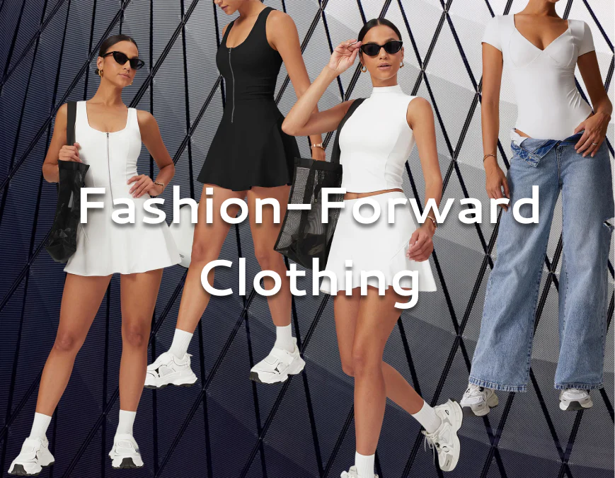
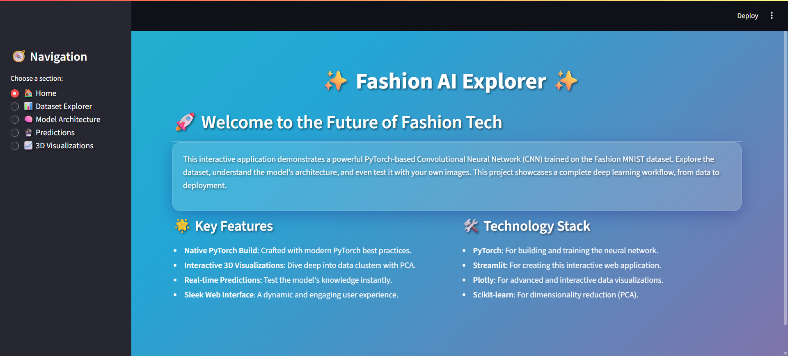
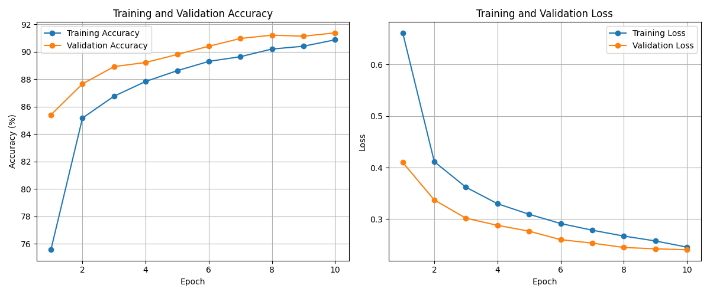
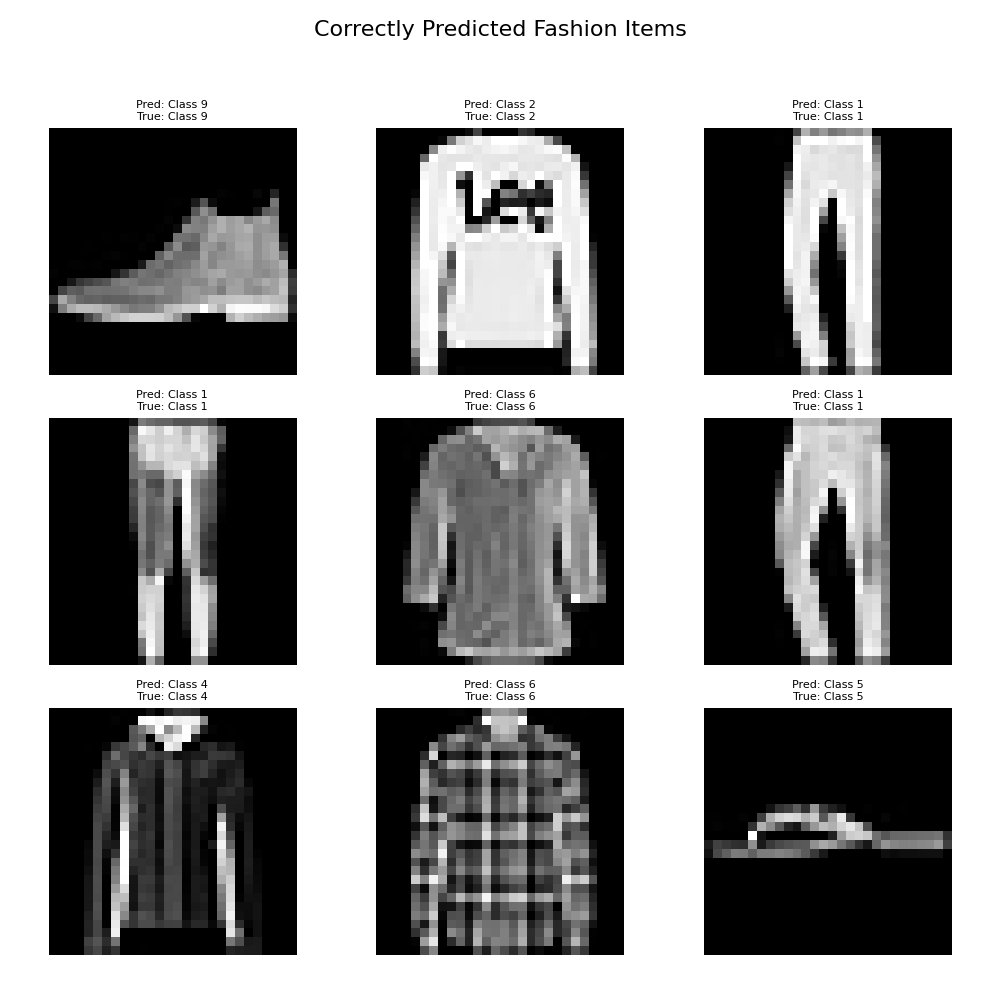
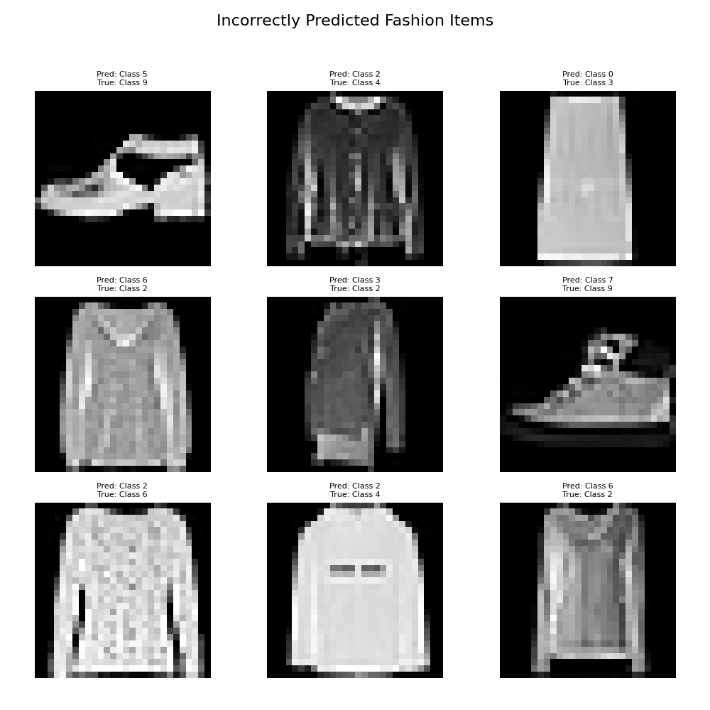

# 🚀 Fashion Forward: An Interactive Deep Learning Showcase

<p align="center">
  
</p>

<p align="center">
  <b>Unveiling the Power of AI in Fashion: A Deep Dive into Image Classification with PyTorch and Streamlit.</b>
</p>

<p align="center">
  <a href="#%EF%B8%8F-project-overview">Overview</a> •
  <a href="#%F0%9F%93%BA-live-demonstration">Live Demo</a> •
  <a href="#%F0%9F%92%A1-conceptual-framework">Conceptual Framework</a> •
  <a href="#%F0%9F%92%BB-technical-architecture">Technical Architecture</a> •
  <a href="#%F0%9F%9A%80-getting-started-a-step-by-step-guide">Getting Started</a> •
  <a href="#%F0%9F%93%81-project-repository-structure">Repository Structure</a> •
  <a href="#%F0%9F%A7%A0-deep-dive-into-model-performance-and-interpretability">Model Performance & Interpretability</a> •
  <a href="#%F0%9F%94%AA-future-horizons-and-potential-enhancements">Future Horizons</a> •
  <a href="#%F0%9F%91%A4-about-the-author">About the Author</a>
</p>

---

## ✨ Project Overview

Welcome to **Fashion Forward**, an ambitious and meticulously crafted deep learning project designed to showcase the transformative capabilities of Artificial Intelligence in the realm of fashion image classification. This interactive web application, powered by **Streamlit** and built upon a robust **PyTorch** Convolutional Neural Network (CNN), offers a unique blend of cutting-edge technology and intuitive user experience. It serves as a comprehensive platform for exploring the intricacies of the Fashion MNIST dataset, analyzing the nuances of model performance, and witnessing the predictive power of AI in real-time.

At its core, Fashion Forward aims to demystify complex deep learning concepts by providing a tangible and engaging interface. Users can delve into the model's decision-making process, understand its strengths and limitations, and even interact with it by uploading their own images for instant classification. The project emphasizes not just the 


technical implementation but also the interpretability and practical application of deep learning models in a visually appealing and user-friendly manner.

### Core Objectives of Fashion Forward:

*   **Demystify Deep Learning**: Provide an accessible platform for users, regardless of their technical background, to understand how CNNs classify images.
*   **Showcase End-to-End Workflow**: Illustrate the complete lifecycle of a deep learning project, from data handling and model architecture to training, evaluation, and deployment.
*   **Enhance Interpretability**: Offer advanced visualization tools to peer into the model's 'mind,' revealing what it learns and how it makes predictions.
*   **Foster Interaction**: Enable real-time interaction with the model through image uploads, making the learning process dynamic and engaging.
*   **Promote Best Practices**: Demonstrate clean code, modular design, and effective use of modern data science and machine learning libraries.

---

## ✨ Key Features: A Deep Dive into Functionality

Fashion Forward is meticulously designed with a suite of features that elevate it beyond a simple classification tool into a comprehensive educational and analytical platform. Each component is crafted to provide maximum insight and user engagement.

### 🎨 **Stunning UI/UX: A Visual Symphony**

The application's interface is a testament to modern web design principles, integrating aesthetic appeal with functional elegance. The choice of an animated gradient background creates a dynamic and immersive environment, while the application of a subtle glassmorphism effect to various containers and cards provides a sophisticated, layered look. This design philosophy ensures that the user experience is not only intuitive but also visually captivating, making the exploration of complex data and model insights a delightful journey. The responsive design further guarantees a seamless experience across a multitude of devices, from large desktop monitors to compact mobile screens.

### 📊 **Performance Dashboard: Unveiling Model Efficacy**

Understanding a model's performance is paramount, and the Performance Dashboard is engineered to provide a granular view of the CNN's classification accuracy and behavior. This section is equipped with interactive visualizations that allow for a thorough analysis of the model's strengths and weaknesses.

*   **Item Distribution in Test Set**: A clear bar chart illustrating the frequency of each fashion category within the test dataset. This provides essential context for evaluating class-wise performance, highlighting potential data imbalances that might influence model bias.
*   **Interactive Confusion Matrix**: A heatmap visualization that quantifies the number of correct and incorrect predictions for each class. This matrix is invaluable for identifying specific categories that the model frequently confuses with others, offering actionable insights for further model refinement or data augmentation strategies.
*   **Per-Class Accuracy**: A detailed bar chart showcasing the accuracy score for each individual fashion category. This allows for a quick assessment of how well the model performs on specific item types, complementing the overall accuracy metric with more nuanced information.

### 🧠 **Model Insights: Peering into the AI's Mind**

This is where the project truly shines in its commitment to interpretability. The Model Insights section provides powerful visualizations that help demystify the internal workings of the Convolutional Neural Network, transforming abstract mathematical operations into comprehensible visual patterns.

*   **CNN Filter Visualization**: This feature allows users to visualize the learned filters of the first convolutional layer. These filters are the fundamental building blocks of the CNN's understanding, acting as basic pattern detectors for edges, textures, and gradients. By observing these filters, one can gain an intuitive understanding of how the model initially processes raw image data.
*   **3D Feature Space with PCA**: Perhaps one of the most compelling visualizations, this interactive 3D scatter plot uses Principal Component Analysis (PCA) to reduce the high-dimensional feature representations learned by the model into a three-dimensional space. Each point in this plot represents an image, colored by its true class. This visualization is crucial for understanding how the model groups similar fashion items and separates distinct categories. It effectively illustrates the model's learned 


semantic understanding of the data, showing how different classes are clustered or, conversely, where overlaps occur, indicating potential areas of confusion for the model.

### 🔮 **Live Prediction Studio: AI in Action**

The Live Prediction Studio is the interactive heart of the application, offering users a direct, hands-on experience with the trained deep learning model. This feature transforms the abstract concept of AI prediction into a tangible and immediate interaction.

Users can upload their own 28x28 grayscale images of fashion items. Upon upload, the application instantly processes the image through the trained CNN. The results are presented in a clear and concise manner:

*   **Predicted Class**: The model's top prediction for the uploaded image, displayed prominently.
*   **Confidence Score**: A numerical value indicating the model's certainty in its prediction. This score provides crucial context, allowing users to gauge the reliability of the classification.
*   **Probability Distribution Chart**: An interactive bar chart that visualizes the probability assigned by the model to each of the ten fashion categories. This detailed breakdown offers transparency into the model's decision-making process, showing not just the winning class but also how close other classes were in terms of likelihood. This is particularly useful for understanding ambiguous cases where the model might be less certain.

This studio serves as an excellent tool for both demonstration and personal experimentation, allowing users to test the model with real-world examples and observe its performance firsthand.

---

## 📺 Live Demonstration

Experience the application live and interact with the AI model directly! This section will host a link to the deployed application and a visual demonstration of its capabilities.

**[🚀 LAUNCH THE LIVE APPLICATION]((http://localhost:8501))**

<p align="center">
  
</p>

*Figure 1: An animated demonstration showcasing the interactive features and dynamic interface of the Fashion Forward application, including navigation between sections and live prediction capabilities.*

---

## 💡 Conceptual Framework: Understanding the Core Principles

This project is built upon fundamental concepts of Deep Learning and Computer Vision, specifically leveraging Convolutional Neural Networks (CNNs) for image classification. Understanding these underlying principles is key to appreciating the project's functionality.

### The Fashion MNIST Dataset

The Fashion MNIST dataset [1] is a widely used benchmark in machine learning, serving as a direct replacement for the original MNIST handwritten digit dataset. It consists of 70,000 grayscale images of fashion products from 10 categories, with 60,000 images for training and 10,000 for testing. Each image is 28x28 pixels. The 10 categories include:

*   T-shirt/top
*   Trouser
*   Pullover
*   Dress
*   Coat
*   Sandal
*   Shirt
*   Sneaker
*   Bag
*   Ankle boot

This dataset is particularly valuable because it presents a slightly more complex classification challenge than the original MNIST, due to the higher visual variability and subtle differences between certain clothing items (e.g., 'T-shirt/top' vs. 'Shirt').

### Convolutional Neural Networks (CNNs)

CNNs are a class of deep neural networks specifically designed for processing pixel data, making them highly effective for image recognition and computer vision tasks [2]. Their architecture is inspired by the organization of the animal visual cortex. Key components of a CNN include:

*   **Convolutional Layers**: These layers apply a set of learnable filters (kernels) to the input image, detecting various features such as edges, textures, and patterns. Each filter slides across the image, performing a dot product and creating a feature map.
*   **Activation Functions (ReLU)**: Rectified Linear Unit (ReLU) functions introduce non-linearity into the model, allowing it to learn more complex patterns. Without non-linearity, a neural network would only be able to learn linear transformations.
*   **Pooling Layers (Max Pooling)**: These layers reduce the spatial dimensions (width and height) of the feature maps, thereby reducing the number of parameters and computations in the network. This also helps in making the detected features more robust to small shifts or distortions in the input image.
*   **Dropout Layers**: A regularization technique where a random selection of neurons are ignored during training. This prevents overfitting by ensuring that the network does not become too reliant on any single neuron or set of neurons.
*   **Fully Connected Layers**: After several convolutional and pooling layers, the high-level features extracted by the CNN are flattened and fed into one or more fully connected layers. These layers perform the final classification based on the learned features.

### The Learning Process

The model learns through a process called **backpropagation** and **gradient descent**. During training, the model processes thousands of images, makes predictions, and then compares these predictions to the true labels. The difference (loss) is then used to adjust the model's internal parameters (weights and biases) iteratively, minimizing the error over time. This iterative adjustment allows the CNN to progressively learn more accurate and abstract representations of the fashion items.

---

## 💻 Technical Architecture: A Stack Overview

This project integrates several powerful technologies to create a seamless and efficient deep learning application. The architecture is designed for clarity, performance, and ease of maintenance.

### PyTorch: The Deep Learning Backbone

PyTorch [3] serves as the foundational deep learning framework for this project. Its dynamic computation graph, Pythonic interface, and strong community support make it an ideal choice for research and development. Within this project, PyTorch is used for:

*   **Model Definition**: Defining the custom Convolutional Neural Network (CNN) architecture, including its layers, activation functions, and forward pass logic.
*   **Training Loop**: Managing the iterative training process, including forward passes, loss calculation, backpropagation, and optimizer steps.
*   **Data Loading and Preprocessing**: Utilizing `torchvision.datasets` and `torch.utils.data.DataLoader` for efficient loading, transformation, and batching of the Fashion MNIST dataset.
*   **Model Serialization**: Saving and loading the trained model's state dictionary (`.pth` file) for deployment and inference.

### Streamlit: Interactive Web Application Framework

Streamlit [4] is an open-source Python library that transforms data scripts into shareable web applications in minutes. It is the primary tool used to build the interactive user interface of Fashion Forward. Streamlit's simplicity and rapid development capabilities allow for:

*   **Dynamic UI Elements**: Creating interactive widgets such as file uploaders, radio buttons, and sliders with minimal code.
*   **Real-time Updates**: Automatically updating the UI as data or model predictions change, providing a fluid user experience.
*   **Caching Mechanisms**: Efficiently caching data loading and model inference results (`@st.cache_resource`, `@st.cache_data`) to optimize performance and reduce re-computation.
*   **Markdown and HTML Integration**: Seamlessly embedding rich text, images, and custom CSS for enhanced visual presentation.

### Plotly & Matplotlib: Advanced Data Visualization

Effective data visualization is crucial for understanding model performance and insights. This project leverages two powerful Python libraries for plotting:

*   **Plotly [5]**: Used for generating interactive and visually appealing charts, such as the confusion matrix, class distribution, per-class accuracy, and the 3D PCA plot. Plotly's interactive features (hover, zoom, pan) allow users to explore data in detail directly within the web application.
*   **Matplotlib [6]**: Employed for static visualizations, particularly for displaying the CNN filters. While Plotly excels in interactivity, Matplotlib provides fine-grained control over static plots, which is ideal for visualizing raw filter weights.

### Scikit-learn: Metrics and Dimensionality Reduction

Scikit-learn [7] is a widely used machine learning library that complements PyTorch by providing essential tools for model evaluation and data analysis:

*   **Confusion Matrix**: Used to calculate the confusion matrix, a fundamental tool for assessing the performance of a classification model.
*   **Principal Component Analysis (PCA)**: Applied for dimensionality reduction, transforming the high-dimensional feature vectors from the CNN into a lower-dimensional space (3D) for visualization. PCA helps in identifying the most significant components that capture the variance in the data, making complex relationships more interpretable.

### Pillow (PIL Fork): Image Processing

Pillow [8] is the friendly fork of the Python Imaging Library (PIL) and is used for handling image operations, particularly for user-uploaded images in the Live Prediction Studio. It enables:

*   **Image Loading**: Opening and reading various image file formats.
*   **Image Conversion**: Converting images to grayscale (`.convert('L')`).
*   **Image Resizing**: Resizing images to the required 28x28 pixel input dimension for the CNN.

---

## 🚀 Getting Started: A Step-by-Step Guide

To set up and run the Fashion Forward application on your local machine, follow these detailed instructions. This guide assumes you have Python and Git installed on your system.

### 1. Clone the Repository

First, open your terminal or command prompt and clone the project repository from GitHub:

```bash
git clone https://github.com/MohamedEl-sadek/Fashion-MNIST/tree/main.git
```

### 2. Create a Dedicated Python Virtual Environment

It is highly recommended to use a virtual environment to manage project dependencies. This isolates the project's libraries from your system-wide Python installation, preventing conflicts and ensuring reproducibility.

**For Windows:**

```bash
python -m venv venv
.\venv\Scripts\activate
```

**For macOS/Linux:**

```bash
python3 -m venv venv
source venv/bin/activate
```

### 3. Install Project Dependencies

With your virtual environment activated, install all the necessary Python libraries listed in the `requirements.txt` file. This file ensures that you have the correct versions of all dependencies.

```bash
pip install -r requirements.txt
```

### 4. Verify Model File Presence

The application relies on a pre-trained PyTorch model. Ensure that the `fashion_mnist_model.pth` file is located in the root directory of your cloned repository (i.e., in the same folder as `app.py`). If this file is missing, the application will not be able to load the model and will raise an error. You would then need to train the model yourself using the `pytorch_fashion_mnist_fast.py` script or a similar training notebook.

### 5. Launch the Streamlit Application

Once all dependencies are installed and the model file is in place, you can launch the web application. While still in your project's root directory and with the virtual environment activated, execute the following command:

```bash
streamlit run app.py
```

Upon successful execution, Streamlit will start a local server, and your default web browser will automatically open a new tab displaying the Fashion Forward application. If the browser does not open automatically, you can manually navigate to the 


local URL provided in your terminal (usually `http://localhost:8501`).

---

## 📁 Project Repository Structure

The project is organized with a clear and intuitive directory structure to facilitate navigation, understanding, and collaboration. Each component serves a specific purpose, ensuring modularity and maintainability.

```
your-repo-name/
│
├── assets/                                  # Contains static assets for the README and application
│   ├── cover_image.png                      # Main cover image for the README
│   ├── app_screenshot.gif                   # Animated GIF demonstrating the app's features
│   ├── correct_predictions.png              # Image showing correctly classified examples
│   ├── incorrect_predictions.png            # Image showing incorrectly classified examples
│   └── training_progress.png                # Image showing training and validation curves
│
├── data/                                    # (Optional) Directory for downloaded datasets (often .gitignore'd)
│
├── app.py                                   # The main Streamlit application script
├── fashion_mnist_model.pth                  # Pre-trained PyTorch model weights (state_dict)
├── pytorch_fashion_mnist_fast.py            # Python script for training the FashionCNN model
├── fashion_mnist_3d_pca.html                # Interactive 3D PCA plot (generated by app, can be included for offline viewing)
├── requirements.txt                         # List of all Python dependencies for the project
└── README.md                                # This comprehensive documentation file
```

---

## 🧠 Deep Dive: Model Performance & Interpretability

Understanding how a deep learning model performs and why it makes certain predictions is as crucial as its accuracy. This section provides a detailed analysis of the FashionCNN model, leveraging visualizations to offer profound insights into its learning process and classification behavior.

### Model Architecture: A Closer Look

The Convolutional Neural Network (CNN) at the heart of this project is designed to efficiently extract hierarchical features from the 28x28 grayscale images of fashion items. Its architecture is a carefully constructed sequence of layers, each contributing to the model's ability to learn increasingly complex representations.

The model's forward pass can be conceptualized as a pipeline:

1.  **Input Layer**: Accepts a single-channel (grayscale) image of size 28x28 pixels.
2.  **Feature Extraction Blocks (Convolutional Layers)**:
    *   **Block 1**: `Conv2d` (1 input channel, 32 output channels, 3x3 kernel, 1 padding) -> `ReLU` activation -> `MaxPool2d` (2x2 kernel, 2 stride) -> `Dropout(0.25)`. This block learns low-level features like edges and simple textures.
    *   **Block 2**: `Conv2d` (32 input channels, 64 output channels, 3x3 kernel, 1 padding) -> `ReLU` activation -> `MaxPool2d` (2x2 kernel, 2 stride) -> `Dropout(0.25)`. This block combines features from the previous layer to detect more complex patterns.
    *   **Block 3**: `Conv2d` (64 input channels, 128 output channels, 3x3 kernel, 1 padding) -> `ReLU` activation -> `Dropout(0.4)`. This final convolutional block extracts high-level, abstract features.
3.  **Flatten Layer**: Converts the 3D feature maps into a 1D vector, preparing them for the fully connected layers.
4.  **Classification Head (Fully Connected Layers)**:
    *   `Linear` (128 * 7 * 7 input features, 128 output features) -> `ReLU` activation -> `Dropout(0.3)`.
    *   `Linear` (128 input features, 10 output features). This final layer outputs the raw scores (logits) for each of the 10 fashion categories.

This progressive layering allows the model to build a rich understanding of the visual characteristics that define each fashion item, from basic lines to intricate garment details.

### Training Progress: Visualizing the Learning Curve

Monitoring the training and validation metrics over epochs is fundamental for assessing a model's learning dynamics. The following plot illustrates how the model's accuracy improved and its loss decreased during the training phase, both on the training data and on unseen validation data.

<p align="center">
  
</p>

*Figure 2: Training and Validation Accuracy (left) and Loss (right) over 10 Epochs. The curves demonstrate consistent learning and a good generalization capability, with validation metrics closely following training metrics, indicating minimal overfitting.*

From these plots, we can observe:

*   **Rapid Initial Learning**: Both accuracy and loss show significant changes in the early epochs, indicating that the model quickly grasps the fundamental patterns in the data.
*   **Convergence**: As training progresses, the curves tend to flatten, suggesting that the model is converging towards an optimal set of weights.
*   **Generalization**: The close proximity of the training and validation curves for both accuracy and loss is a positive sign, indicating that the model is generalizing well to unseen data and is not severely overfitting.

### Prediction Analysis: Understanding Successes and Failures

Examining individual predictions, especially misclassifications, provides invaluable qualitative insights into the model's behavior. It helps us understand not just *how well* the model performs, but *why* it might struggle with certain categories or visual ambiguities.

#### Correctly Predicted Fashion Items

These examples showcase the model's proficiency in accurately classifying a diverse range of fashion items. They highlight the model's ability to discern subtle visual cues and assign the correct label, demonstrating its learned feature representations.

<p align="center">
  
</p>

*Figure 3: A selection of images from the test set that were correctly classified by the FashionCNN model. Each image is annotated with its predicted class (Pred) and true class (True), which are identical in these cases.*

#### Incorrectly Predicted Fashion Items

Analyzing misclassifications is a critical step in model debugging and improvement. These examples reveal the challenging cases where the model's prediction deviates from the true label, often due to visual similarities between classes or inherent ambiguities in the images.

<p align="center">
  
</p>

*Figure 4: Examples of images from the test set that were incorrectly classified by the FashionCNN model. These highlight instances where the predicted class (Pred) differs from the true class (True), providing insights into the model's limitations.*

Common reasons for misclassifications might include:

*   **Inter-class Similarity**: Items like 'T-shirt/top', 'Shirt', and 'Pullover' can share similar silhouettes, making them visually ambiguous even for humans.
*   **Image Quality/Resolution**: The 28x28 pixel resolution can sometimes obscure fine details crucial for differentiation.
*   **Pose/Orientation**: Unusual orientations of clothing items might present features that the model hasn't learned to recognize robustly.

### Key Insights from Visualizations: Demystifying the Model's Perception

Beyond quantitative metrics, visual interpretability tools offer a qualitative understanding of the model's internal representations.

*   **CNN Filters (First Layer)**: While not directly embedded here, the visualization of the first convolutional layer's filters (as seen in the Streamlit app's 


Model Insights section) reveals that the model initially learns to detect fundamental visual primitives such as edges, lines, and simple textures. These low-level features serve as the building blocks upon which deeper layers construct more abstract and complex representations of fashion items.

*   **3D PCA Plot of High-Level Features**: This interactive visualization is a cornerstone for understanding the model's learned feature space. By reducing the high-dimensional output of the model's penultimate layer to three principal components, we can observe how the model intrinsically groups different fashion categories.

<p align="center">
  
</p>

*Figure 5: Interactive 3D PCA plot of the model's high-level features. Each point represents an image from the test set, colored by its true fashion category. This visualization helps in understanding the separability of classes in the learned feature space and identifying areas of overlap.*

Key observations from the PCA plot typically include:

*   **Clear Clustering**: Distinct clusters for well-separated classes (e.g., 'Ankle boot', 'Bag', 'Trouser') indicate that the model has learned highly discriminative features for these categories.
*   **Overlapping Regions**: Areas where clusters overlap (e.g., 'T-shirt/top', 'Shirt', 'Pullover') signify classes that are visually similar and thus more challenging for the model to distinguish. This visual evidence directly correlates with the misclassifications observed in the confusion matrix.

This holistic view, combining quantitative metrics with visual interpretability, provides a comprehensive understanding of the FashionCNN model's capabilities and areas for potential enhancement.

---

## 🔮 Future Horizons and Potential Enhancements

This project serves as a robust foundation for further exploration and development in deep learning and computer vision. Here are several exciting avenues for future work, aimed at expanding functionality, improving performance, and enhancing user experience:

*   **Implement a Model Training Tab**: Develop an interactive section within the Streamlit application that allows users to train the model from scratch. This feature would expose key hyperparameters (e.g., number of epochs, learning rate, batch size, optimizer choice) to the user, providing a hands-on experience with model training and optimization. This would transform the app into a full-fledged educational tool for deep learning.
*   **Explore Advanced Architectures**: Integrate and compare the performance of more sophisticated pre-trained CNN architectures (e.g., ResNet, VGG, MobileNet) or even explore the application of Vision Transformers (ViT) to the Fashion MNIST dataset. This would allow for benchmarking and potentially achieving higher accuracy.
*   **Integrate Grad-CAM for Explainability**: Implement Grad-CAM (Gradient-weighted Class Activation Mapping) visualizations. This technique generates heatmaps that highlight the specific regions in the input image that are most influential in the model's prediction. This offers crucial insights into *why* the model makes a particular decision, significantly enhancing model interpretability and trustworthiness.
*   **Containerize with Docker**: Create a `Dockerfile` and associated configurations to containerize the entire application. This would ensure consistent environments across different deployment platforms, simplify dependency management, and make the application highly portable and scalable for production environments.
*   **Expand Dataset and Classes**: Move beyond the Fashion MNIST dataset to larger and more complex fashion datasets (e.g., DeepFashion, Zalando Research's Fashion-MNIST-Extended). This would allow for classification of a wider range of clothing items, attributes (e.g., color, material), and potentially transition from grayscale to color image classification.
*   **Real-time Video Inference**: Develop functionality to perform real-time inference on video streams (e.g., from a webcam). This would enable users to point their camera at clothing items and see live predictions, creating a highly engaging and practical application.
*   **Adversarial Examples Generation**: Add a module to generate adversarial examples. This would demonstrate how small, often imperceptible, perturbations to input images can trick the model into misclassifying them. This feature would highlight the robustness and vulnerability of deep learning models, fostering a deeper understanding of their limitations.
*   **Model Quantization and Optimization**: Explore techniques like model quantization to reduce the model size and inference time, making it more suitable for deployment on edge devices or in resource-constrained environments.
*   **User Feedback Loop**: Implement a mechanism for users to provide feedback on predictions, especially for misclassifications. This feedback could potentially be used to retrain or fine-tune the model, creating a continuous improvement loop.

---

## 👤 About the Author

This project was conceived, designed, and developed by:

### Mohamed El-sadek Mohamed

**Location**: Zagazig, Al Sharkia, Egypt

**Contact Information**:
-   **Phone**: `+201211820468`
-   **Email**: `mohamed122074@gmail.com`

**Online Professional Profiles**:
-   **LinkedIn**: [Mohamed El-sadek](http://www.linkedin.com/in/mohamed-el-sadek-396163249)
-   **GitHub**: [MohamedEl-sadek](https://github.com/MohamedEl-sadek)
-   **Kaggle**: [MohamedElsadek44](https://www.kaggle.com/mohamedelsadek44)

---
